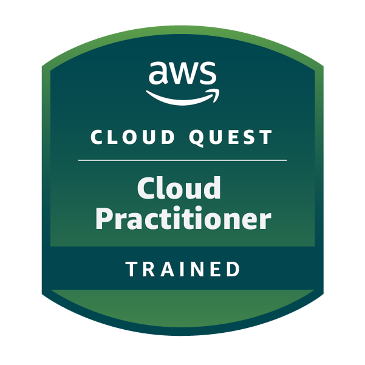

<p align="center">
  
</p>

- I’m a **Software Developer and DevOps Engineer** focused on building and operating **scalable, reliable, and automated cloud-native systems**.

- I work across the delivery lifecycle — from **backend architecture and API design** to **CI/CD automation, container orchestration, and cloud infrastructure** — with a strong focus on **production readiness, observability, and reliability**.

- I enjoy solving complex problems through **clean architecture, Infrastructure as Code, and automation-first workflows**, and I’m continuously improving systems to be **easy to operate, debug, and scale**.

---

<h3 align="left">🛠️ Skills & Technologies</h3>

<p align="left">
  <strong>Languages:</strong><br>
  
  
  
  
</p>

<p align="left">
  <strong>Backend & Frameworks:</strong><br>
  
  
  
  
  
</p>


<p align="left">
  <strong>DevOps, Cloud, Infrastructure & Monitoring:</strong><br>
  
  
  
  
  
  
  
<!--  
  
</p>
-->
<p align="left">
  <strong>Databases:</strong><br>
  
  
  
</p>

<p align="left">
  <strong>Tools & Version Control:</strong><br>
  
  
  
</p>

---

<h3 align="left">🔗 Coding Profiles</h3>

<p align="left">
  <a href="https://www.leetcode.com/kirtan_2408" target="_blank">
    
  </a>
  <a href="https://www.geeksforgeeks.org/profile/pithadiyamhtt?tab=activity" target="_blank">
    
  </a>
</p>

---

<h3 align="left">🌟 Featured Projects</h3>

<table width="100%">
<tr>

<!-- ================= PROJECT 1: PropEase ================= -->
<td>

<h2 align="center">🏠 PropEase</h3>

<div align="center">
  


</div>

### 📋 Project Overview

A **production-grade real estate management platform** enabling users to list, discover, rent, and manage properties through a secure and scalable web application. Built with microservice-oriented architecture on AWS ECS Fargate for complete serverless operation.

### ✨ Key Features

- **Smart Property Discovery** - Advanced filtering with interactive map-based browsing
- **Real-Time Communication** - WebSocket-based chat between buyers and sellers
- **Secure Authentication** - JWT-based with role-based access control (RBAC)
- **Financial Tools** - Integrated EMI calculator for loan planning
- **Zero Server Management** - Fully containerized on AWS Fargate

### 🎯 Technical Highlights

```
✓ Microservice architecture on AWS ECS
✓ Automated CI/CD pipelines
✓ Horizontal auto-scaling
✓ 99.9% uptime guarantee
```
<div align="center">

[](https://github.com/harshwadhwani-10/PropEase-Real-Estate-Management-System)
[](https://www.propease-reality.shop/)

</div>

</td>
</tr>

<tr>
<!-- ================= PROJECT 2: Template.io ================= -->
<td>

<h2 align="center">📝 Template.io</h2>

<div align="center">
  


</div>

### 📋 Project Overview

A **centralized Template Management System (TMS)** designed to streamline document and email template workflows for teams and businesses. Eliminates manual document creation, inconsistent formatting, and approval bottlenecks through automation and security.

### ✨ Key Features

- **Centralized Repository** - Single source of truth for all templates
- **Dynamic Fields** - Automated document generation with variable data
- **Role-Based Access** - Granular permissions for different user types
- **E-Signature Integration** - Built-in digital signature workflows
- **Email Management** - Tracking, scheduling, and resending capabilities

### 🎯 Problems Solved

```
✓ Eliminates manual document creation
✓ Ensures consistent branding
✓ Streamlines approval workflows
✓ Tracks document usage and metrics
```

<div align="center">

[](https://github.com/Kirtan24/Template.io) 
[](https://template-io-one.vercel.app/)

</div>

</td>

</tr>
<tr>

<!-- ================= PROJECT 3: Cloudlet ================= -->
<td>

<h2 align="center">☁️ Cloudlet</h2>

<div align="center">
  


</div>

### 📋 Project Overview

A **cloud-native media storage and delivery platform** for securely uploading, managing, and delivering media assets (images, videos, files) at scale. Abstracts the complexity of media handling, security, and scalability for developers.

### ✨ Key Features

- **Secure Uploads** - Pre-signed URLs eliminate credential exposure
- **Metadata Management** - Centralized asset tracking and organization
- **Global CDN Delivery** - Low-latency content delivery worldwide
- **Developer-Friendly API** - RESTful endpoints with comprehensive docs

### 🎯 Problems Solved

```
✓ Eliminates slow upload/download speeds
✓ Provides infinite scalability
✓ Secures storage credentials
✓ Enables usage tracking and analytics
✓ Reduces infrastructure management
```

<div align="center">

[](https://github.com/Kirtan24/Cloudlet)

</div>

</td>
</tr>
<tr>
<!-- ================= PROJECT 4: Nexus Library ================= -->
<td >

<h2 align="center">📚 Nexus Library</h2>

<div align="center">
  


</div>

### 📋 Project Overview

A **desktop-based digital library management system** implementing object-oriented programming principles and design patterns for efficient resource handling. Manages books, users, and lending workflows with reliable database-backed persistence.

### ✨ Key Features

- **Book Management** - Complete CRUD operations for library resources
- **Member Tracking** - User registration and profile management
- **Issue/Return System** - Automated lending workflow with due dates
- **PostgreSQL Backend** - Reliable persistent data storage
- **Clean Architecture** - Strong OOP foundation with design patterns

### 🎯 Technical Highlights

```
✓ Object-oriented design principles
✓ MVC architecture pattern
✓ Transaction management
✓ Intuitive desktop UI
```

<div align="center">


[](https://github.com/Kirtan24/Nexus-Library)

</div>

</td>

</tr>
</table>

---

<h3 align="left">🏆 Achievements</h3>

<p align="center">
  
  
</p>


---
<!--
<p align="center">
  
</p>

<p align="center">
  
</p>
-->


<p align="center">
  <a href="https://www.linkedin.com/in/kirtan-pithadiya/">
    
  </a>
  <a href="mailto:pithadiyakirtan08@gmail.com">
    
  </a>
  <a href="https://github.com/Kirtan24">
    
  </a>
</p>


<h3 align="center">
  🧠 Building systems that are reliable, observable, and easy to operate at scale.
</h3>

